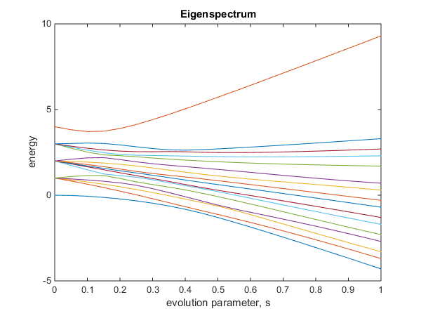

# Eigenspectrum

Calculate the eigenspectrum between two Hamilontians

### Functions:

-   Function: eigenspectrum
    - Description: Used to plot evolution of the eigenspectrum between two Hamiltonians   
    -   Parameters:
        -   required: start hamiltonian (2^n by 2^n matrix)
        -   required: finish hamiltonian (2^n by 2^n matrix)
        -   required: number of steps (int)
        -   optional: figures to plot (int: 0,1,2) 
            - 0: Normal eigenspectrum (default)
            - 1: Eigenspectrum relative to groundstate
            - 2: Both
    -   Example: 'test_eigenspectrum'

```Matlab
% Example Ising coef for n=4 qubits
% Array of h coef for local fields
h = [1,0.5,0.8,1];
% Matrix of J coef for Z-Z, X-X, Z-Z-Z and X-X-X couplings
Jzz  = [[0,1,0,0];[1,0,0,0];[1,1,0,0];[1,0,1,0]];
Jxx  = 0; % Couplings turned off
Jzzz = 0; % Couplings turned off
Jxxx = 0; % Couplings turned off

% Calculate and plot eigenspectrum between two Hamilontians
eigenspectrum(  transverse_hamiltonian(4),...                   % Starting (transverse) Hamiltonian
                ising_hamiltonian(h, Jzz, Jxx, Jzzz, Jxxx), ... % Finishing (Ising) Hamiltonian
                21, ...                                         % Steps
                2);                                             % Optional: figures to plot
```



-   Function: transverse_hamiltonian
    - Description: Returns an n-qubit transverse field Hamiltonian  
    -   Parameters:
        -   required: number of qubits, n (int)
-   Function: ising_hamiltonian
    - Description: Given local fields, h and couplings, Jzz, Jxx, Jzzz, Jxxx returns the Ising Hamiltonian  
    -   Parameters:
        -   required: array of h coefficients, h (n-array)
        -   required: matrix of ZZ coefficients, Jzz (n by n matrix)
        -   required: matrix of XX coefficients, Jxx (n by n matrix)
        -   required: matrix of ZZZ coefficients, Jzzz (n by n by n matrix)
        -   required: matrix of XXX coefficients, Jxx (n by n by n matrix)
    -   Return: Ising Hamiltonian
-   Function: recursive_kron
    - Description: Returns Kronecker tensor product of a single qubit matrix on a specified qubit with the identity matrix on all other qubits
    -   Parameters:
        -   required: total number of qubits, n (int)
        -   required: index of qubit to insert matrix, i (int)
        -   required: single qubit operation (2 by 2 matrix)
        -   ignore: matrix from previous recursive call (leave empty)
    -   Return: Hamiltonian with operation on a single qubit (2^n by 2^n matrix)
-   Function: recursive_kron_double
    - Description: Returns Kronecker tensor product of two single qubit matrices on two specified qubits with the identity matrix on all other qubits
    -   Parameters:
        -   required: total number of qubits, n (int)
        -   required: index of first qubit to insert matrix, i (int)
        -   required: first single qubit operation (2 by 2 matrix)
        -   required: index of second qubit to insert matrix, i (int)
        -   required: second single qubit operation (2 by 2 matrix)
        -   ignore: matrix from previous recursive call (leave empty)
    -   Return: Hamiltonian with operations on two single qubits (2^n by 2^n matrix)
-   Function: recursive_kron_triple
    - Description: Returns Kronecker tensor product of three single qubit matrices on three specified qubits with the identity matrix on all other qubits
    -   Parameters:
        -   required: total number of qubits, n (int)
        -   required: index of first qubit to insert matrix, i (int)
        -   required: first single qubit operation (2 by 2 matrix)
        -   required: index of second qubit to insert matrix, i (int)
        -   required: second single qubit operation (2 by 2 matrix)
        -   required: index of third qubit to insert matrix, i (int)
        -   required: third single qubit operation (2 by 2 matrix)
        -   ignore: matrix from previous recursive call (leave empty)
    -   Return: Hamiltonian with operations on three single qubits (2^n by 2^n matrix)