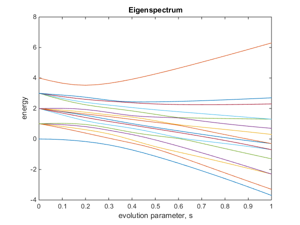

# Eigenspectrum

Calculate the eigenspectrum between two Hamilontians

### Functions:

-   Function: **eigenspectrum**
    - Description: Calculate the eigenvalues throughout the evolution between two Hamiltonians   
    -   Parameters:
        -   required: start hamiltonian (2^n by 2^n matrix)
        -   required: finish hamiltonian (2^n by 2^n matrix)
        -   required: number of steps, S (int)
    -   Return: Eigenvalues at each step (2^n by S)
    -   Examples:
        -   '**examples/example_eigenspectrum.m**' (see below)
        -   '**examples/example_eigenspectrum_random.m**'

```Matlab
% Example Ising coef for n=4 qubits

% Add main directory to path
addpath('../');

% Array of h coef for local fields
h = [1,0.5,0.8,1];
% Matrix of J coef for Z-Z, X-X, Z-Z-Z and X-X-X couplings
Jzz  = [[0,1,0,0];[0,0,0,1];[0,0,0,1];[0,0,0,0]];
Jxx  = 0; % Couplings turned off
Jzzz = 0; % Couplings turned off
Jxxx = 0; % Couplings turned off

% Calculate and plot eigenspectrum between two Hamilontians
eigenvalues = ...
eigenspectrum(  transverse_hamiltonian(4),...                   % Starting (transverse) Hamiltonian
                ising_hamiltonian(h, Jzz, Jxx, Jzzz, Jxxx), ... % Finishing (Ising) Hamiltonian
                21);                                            % Steps
            
% Plot eigenspectrum ('2' means both plots)
plot_eigenspectrum(eigenvalues, 2);
% Calculate and display minimum gap
disp(minimum_gap(eigenvalues));
```



-   Function: **transverse_hamiltonian**
    -   Description: Returns an n-qubit transverse field Hamiltonian  
    -   Parameters:
        -   required: number of qubits, n (int)
-   Function: **ising_hamiltonian**
    -   Description: Given local fields, h and couplings, Jzz, Jxx, Jzzz, Jxxx returns the Ising Hamiltonian  
    -   Parameters:
        -   required: array of h coefficients, h (n-array), (0 to turn off fields)
        -   required: matrix of ZZ coefficients, Jzz (n by n matrix), (0 to turn off couplings)
        -   required: matrix of XX coefficients, Jxx (n by n matrix), (0 to turn off couplings)
        -   required: matrix of ZZZ coefficients, Jzzz (n by n by n matrix), (0 to turn off couplings)
        -   required: matrix of XXX coefficients, Jxx (n by n by n matrix), (0 to turn off couplings)
    -   Return: Ising Hamiltonian (2^n by 2^n matrix)
-   Function: **plot_eigenspectrum**
    -   Description: Given eigenvalues, plots the eigenspectrum
    -   Parameters:
        -   required: eigenvalues (2^n by S)
        -   optional: figures to plot (int: {0,1,2})
            - 0: Normal eigenspectrum (default)
            - 1: Eigenspectrum relative to groundstate
            - 2: Both
    -   Output: Eigenspectrum plot(s)
-   Function: **minimum_gap**
    -   Description: Given eigenvalues, returns the minimum energy gap between the ground and first excited states
    -   Parameters:
        -   required: eigenvalues (2^n by S)
	-   optional: Range (from start) to look over (int: [0,1])
    -   Return: Minimum energy gap between ground and first excited states (double)
-   Function: **random_coef**
   -   Description: Generates a random array/matrix of values/coefficients
   -   Parameters:
      - Required: Dimensions of matrix (array)
      - Required: Type of values (0: Discrete, 1: Continuous)
      - Required: Range of values (Array: Discrete:[values], Continuous:[min, max])
      - Required: Distribution (0: Uniform, 1: Normal/Gaussian)
      - Required: Density of (non-zero) values (int: {0,1})
   -   Returns:
      - Matrix with random values at a specified density (of non-zero values)
-   Function: **recursive_kron**
    -   Description: Returns Kronecker tensor product of N single qubit matrices on N specified qubits with the identity matrix on all other qubits
    -   Parameters:
        -   required: total number of qubits, n (int)
        -   required: Array of indices to insert matrices, (array)
        -   required: Array of single qubit operations (array of 2 by 2 matrices)
        -   ignore: matrix from previous recursive call (leave empty)
    -   Return: Hamiltonian with operations on two single qubits (2^n by 2^n matrix)
