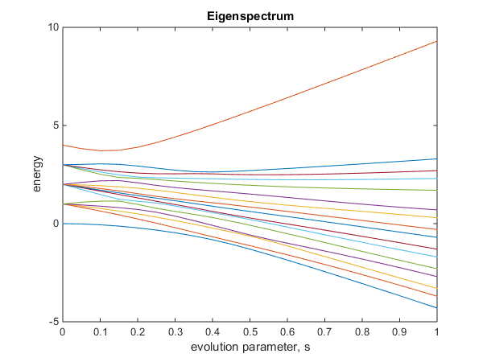

# Eigenspectrum

### Examples

-   **examples/example_eigenspectrum.m**

```Matlab
% Example Ising coef for n=4 qubits

% Add main directory to path
addpath('../');

% Array of h coef for local fields
h = [1,0.5,0.8,1];
% Matrix of J coef for Z-Z, X-X, Z-Z-Z and X-X-X couplings
Jzz  = [[0,1,0,0];[0,0,0,1];[0,0,0,1];[0,0,0,0]];
Jxx  = 0; % Couplings turned off
Jzzz = 0; % Couplings turned off
Jxxx = 0; % Couplings turned off

% Calculate and plot eigenspectrum between two Hamilontians
eigenvalues = ...
eigenspectrum(  transverse_hamiltonian(4),...                   % Starting (transverse) Hamiltonian
                ising_hamiltonian(h, Jzz, Jxx, Jzzz, Jxxx), ... % Finishing (Ising) Hamiltonian
                21);                                            % Steps
            
% Plot eigenspectrum ('2' means both plots)
plot_eigenspectrum(eigenvalues, 2);
% Calculate and display minimum gap
disp(minimum_gap(eigenvalues));
```



-   **examples/example_eigenspectrum_random.m**

```Matlab
% Example random Ising coef for n=4 qubits

% Add main directory to path
addpath('../');

% Array of h coef for local fields
n_qubits = 4;
density = 0.5;
min = 0;
max = 1;
% Random h coef
h = random_coef( [n_qubits], 1, [min, max], 0, density );
% Random J coef for Z-Z, X-X, Z-Z-Z and X-X-X couplings
Jzz  = random_coef( [n_qubits, n_qubits], 1, [min, max], 0, density );
Jxx  = 0; % Couplings turned off
Jzzz = 0; % Couplings turned off
Jxxx = 0; % Couplings turned off

% Calculate and plot eigenspectrum between two Hamilontians
eigenvalues = ...
eigenspectrum(  transverse_hamiltonian(n_qubits),...            % Starting (transverse) Hamiltonian
                ising_hamiltonian(h, Jzz, Jxx, Jzzz, Jxxx), ... % Finishing (Ising) Hamiltonian
                21);                                            % Steps

% Plot eigenspectrum ('2' means both plots)
plot_eigenspectrum(eigenvalues, 2);
% Calculate and display minimum gap
disp(minimum_gap(eigenvalues));
```
